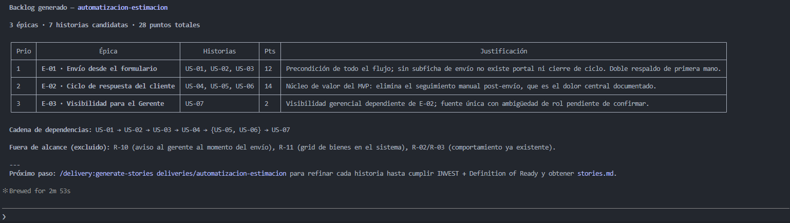
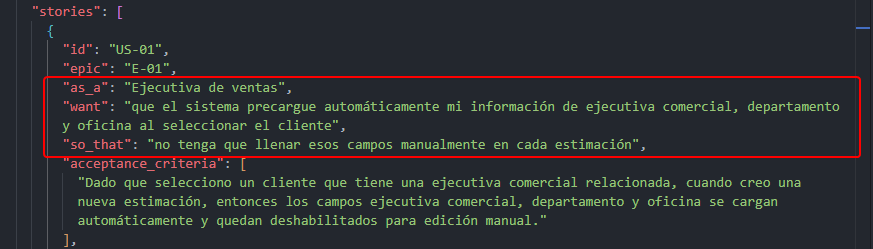
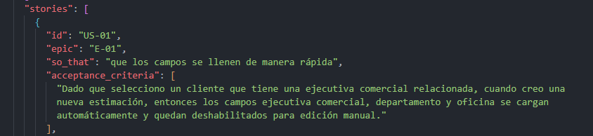
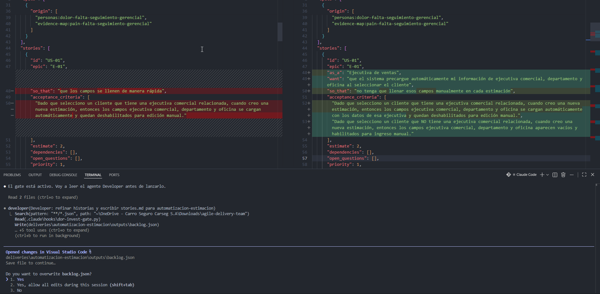
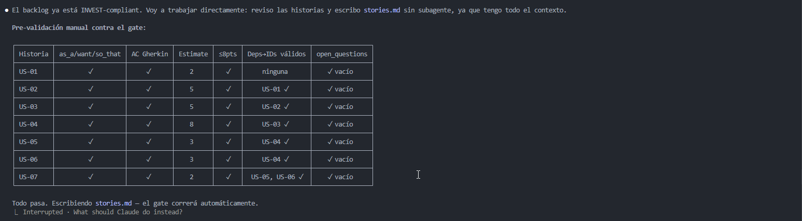
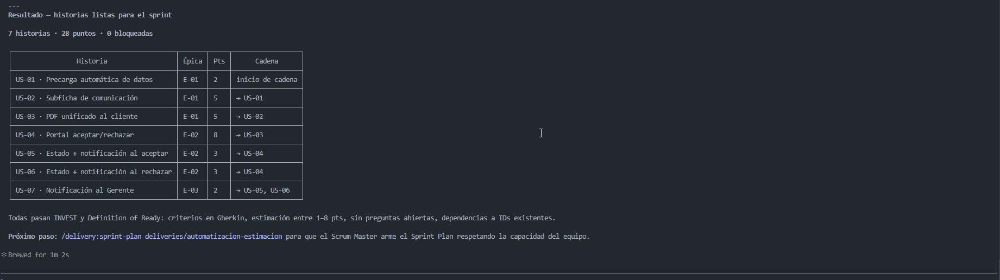
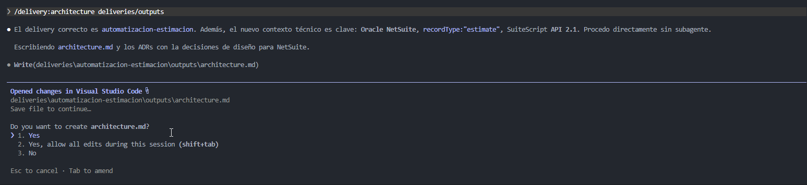
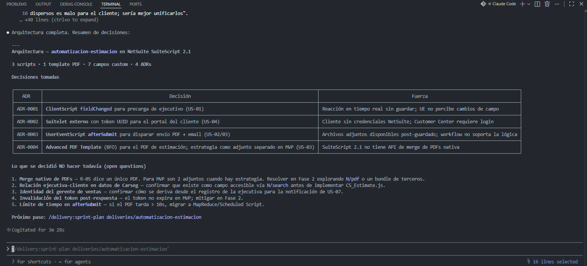
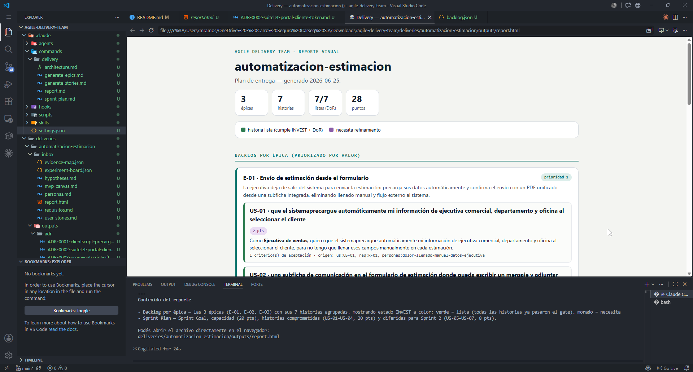

# agile-delivery-team
An agile Delivery team Power by AI

# Preparar materia prima y armar el inbox

Primero se debe cargar el output del descubrimiento anterior en `deliveries/automatizacion-estimacion/inbox`.

Las salidas del equipo ahora estaran en `deliveries/automatizacion-estimacion/outputs`

# Armar el equipo de agentes

`CLAUDE.md` — la constitución con las reglas de cero invención, trazabilidad, aislamiento entre deliveries e idioma español.

La skill `delivery` con los formatos canónicos: épica, historia INVEST, esquema de backlog.json, ADR (formato MADR breve), Sprint Plan y la Definition of Ready.
Los cuatro subagentes: `product-owner`, `developer`, `architect` y `scrum-master`, cada uno con su frontmatter y su rol.

Los comandos `/delivery:generate-epics`, `/delivery:generate-stories`, `/delivery:architecture`, `/delivery:sprint-plan` y `/delivery:report`.

El hook `dor-invest-gate.py` (PreToolUse, matcher Write|Edit), registrado en `.claude/settings.json`, que custodia la escritura de stories.md y sprint-plan.md.

# Ejecución del flujo - demo de ejecución del gate

Para esto se debe ejecutar el comando `/delivery:generate-epics deliveries/automatizacion-estimacion`, ya que esto genera las épicas (`epics.md`) y `backlog.json` en la carpeta de `deliveries/automatizacion-estimacion/outputs`

Ahora para **generar el bloqueo**, debemos ir al archivo de `backlog.json` y modificar en las `stories`, editamos el archivo ya sea eliminando una propiedad del objeto o modificamos el contenido.

Veamos el antes de la modificación

Ahora veamos el despues de la modificación

Para verificar el bloqueo ahora se debe ejecutar el comando `/delivery:generate-stories automatizacion-estimacion/outputs`

## Resolución del bloqueo
Entonces se verifica el gate y el backlog antes de lanzar el subagente Developer.

En este caso, el hook lanza que se debe corregir el archivo en el cual forzamos el bloqueo.

Una vez permitido el cambio en el `backlog.json` corregido, se creara el archivo `stories.md`

En resumen se genera

Ahora cuando ejecutamos el siguiente comando `/delivery:architecture automatizacion-estimacion/outputs`.

Esto genera las ADR-### en `automatizacion-estimacion/outputs/adr`

El sisguiente paso ese ejecutar el `/delivery:sprint-plan deliveries/automatizacion-estimacion`, esto genera el archivo `sprint-plan.md`, `sprint-plan.json`.
Podemos observar que el Sprint Plan no se sobrecompromete (puntos comprometidos ≤ capacidad)

| Historia | Descripción | Pts | Épica | Prioridad |
|----------|-------------|-----|-------|-----------|
| US-01 | Precarga automática de datos de ejecutiva | 2 | E-01 | 1 |
| US-02 | Subficha de comunicación con mensaje y adjuntos | 5 | E-01 | 2 |
| US-03 | PDF unificado para el cliente | 5 | E-01 | 3 |
| US-04 | Portal de aceptación/rechazo en línea | 8 | E-02 | 4 |

Por ultimo ejecutamos el comando `/delivery:report deliveries/automatizacion-estimacion`, el cual crea el archivo `report.html`.

Para su revisión a mas detalle, revisar el archivo correspondiente `report.html`.

# Reflexión - Agile delivery team

## ¿Qué cambió en tu plan cuando separaste el trabajo en cuatro roles en vez de pensarlo "todo junto"?

Cuando se realizo el discovery agent, una sola persona piensa todo junto, entonces tiende a optimizar desde una perspectiva individual.
Por ejemplo se mezcla el valor de negocio con las preferencias técnicas en una única decisión.
En cambio cuando estaba realizando el agile delivery team se  separa el trabajo desde un inicio en 4 roles, entonces las prioridades pasan a ser un proceso de equipo, por lo que cada rol aporta un criterio distinto y obliga a justificar las decisiones que se toman antes de pasar al siguiente.

## ¿Qué historia te costó más dejar lista según INVEST, y por qué?

Según INVEST fue US-04 (el portal de aceptación/rechazo), porque concentra la mayor lógica del flujo y dependía de varias historias posteriores (US-05 · Actualización automática de estado y notificación al aceptar , US-06 · Actualización automática de estado y notificación al rechazar, US-07 · Notificación al Gerente de ventas). El mayor reto fue cumplir el criterio Small (S), ya que dividirla implicaba generar historias que no entregaban valor de forma independiente, asegurando que siguiera siendo independiente, estimable, testeable y con un valor claro para el usuario.

## ¿Para qué te serviría un gate de Definition of Ready en tu equipo real?

Me serviría para asegurar que una historia esté realmente lista antes de entrar al sprint, de esta manera los problemas se detecta antes de comenzar el desarrollo, reduciendo cambios durante el sprint y permitiendo que el equipo trabaje con mayor claridad y organización.