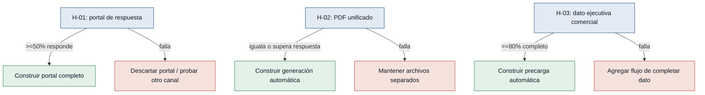

# Hipótesis y experimentos — Automatización de estimación

> Supuestos extraídos del bloque "Riesgos / supuestos" de `mvp-canvas.md`.
> Ordenadas de mayor a menor riesgo: primero se prueba lo que más puede
> tumbar el MVP. No se incluyó como hipótesis la ambigüedad de etiqueta de
> rol en `ejecutiva-ventas3.md` (ver `personas.md`) porque es un problema de
> calidad de evidencia interna, no un supuesto de negocio comprobable con un
> experimento de mercado — se resuelve confirmando con quien gestiona las
> entrevistas, no con un experimento.

## Árbol de decisión (vista rápida)

### [H-01] El cliente responde desde un portal en línea — riesgo: alto
- **Supuesto a probar:** el cliente está dispuesto a revisar y responder
  (aceptar/rechazar) una estimación desde un portal en línea, en vez de
  contestar por correo o teléfono a la ejecutiva.
- **Hipótesis:** Creemos que el cliente revisará y responderá su estimación
  desde un portal en línea si el correo incluye un enlace directo y claro a
  esa página, porque ya está acostumbrado a recibir la estimación por correo
  y solo le pedimos un clic adicional para decidir.
- **Señal medible:** % de clientes que, al recibir un correo de prueba con un
  enlace a una página de "revisar y responder", hacen clic y completan la
  acción (aceptar/rechazar) sin que la ejecutiva los llame.
- **Criterio de éxito:** al menos 50% de los clientes contactados en la
  prueba completan la respuesta en el portal dentro de 72 horas, sin llamada
  de seguimiento de la ejecutiva.
- **Experimento:** Fake door / Mago de Oz — enviar a 15-20 clientes reales un
  correo con un botón "Revisar y responder mi estimación" que lleve a una
  página simple gestionada a mano (sin backend); medir clics y respuestas
  durante 1 semana.
- **Caja de tiempo/costo:** 1 semana, sin desarrollo de backend.
- **Regla de decisión:** Si ≥50% responde por el portal → construir el portal
  completo (US-04 a US-08). Si falla (<50%) → descartar el portal y
  mantener/mejorar el seguimiento manual, o probar un recordatorio por otro
  canal antes de invertir en desarrollo.

### [H-02] El cliente acepta el PDF unificado — riesgo: medio
- **Supuesto a probar:** el cliente prefiere, o al menos no rechaza, recibir
  la estimación como un solo PDF unificado (estrategia + plantilla + bienes)
  en vez de documentos separados.
- **Hipótesis:** Creemos que el cliente entenderá y responderá mejor a la
  propuesta si la recibe en un solo PDF unificado en vez de varios archivos
  separados, porque la propia ejecutiva señaló que los documentos dispersos
  le quitan tiempo al cliente.
- **Señal medible:** % de estimaciones enviadas que reciben respuesta del
  cliente (apertura confirmada o respuesta), comparando el PDF unificado vs.
  el envío de archivos separados.
- **Criterio de éxito:** el PDF unificado logra una tasa de respuesta igual o
  superior a la de archivos separados, con al menos 10 estimaciones enviadas
  por variante.
- **Experimento:** Prototipo desechable + envío manual (Mago de Oz) — la
  ejecutiva arma a mano el PDF unificado para la mitad de sus próximas
  estimaciones y mantiene el envío de archivos separados para la otra mitad;
  se compara la tasa de respuesta durante 2 semanas.
- **Caja de tiempo/costo:** 2 semanas, sin desarrollo; solo trabajo manual de
  armar el PDF.
- **Regla de decisión:** Si el unificado iguala o supera la tasa de respuesta
  → construir la generación automática del PDF unificado (R-05). Si falla
  (tasa menor) → mantener el envío de archivos separados y no construir la
  unificación automática.

### [H-03] El cliente ya tiene ejecutiva comercial cargada — riesgo: bajo
- **Supuesto a probar:** la mayoría de los clientes activos ya tienen una
  "ejecutiva comercial" relacionada en su registro del sistema, dato
  necesario para que la precarga automática (US-01) tenga de dónde tomar la
  información.
- **Hipótesis:** Creemos que la precarga automática de ejecutiva
  comercial/departamento/oficina (US-01) será útil para la mayoría de las
  estimaciones si la mayoría de los clientes activos ya tienen ese campo
  relacionado y completo, porque sin ese dato el sistema no tendría qué
  precargar.
- **Señal medible:** % de clientes activos (con al menos una estimación en
  los últimos 6 meses) que tienen el campo "ejecutiva comercial" relacionado
  y completo en su registro.
- **Criterio de éxito:** al menos 80% de los clientes activos tienen el
  campo completo.
- **Experimento:** Auditoría de datos — consulta directa a la base de
  clientes activos (sin construir nada) para calcular el porcentaje con el
  campo completo.
- **Caja de tiempo/costo:** 2-3 días, una consulta/reporte, sin desarrollo de
  producto.
- **Regla de decisión:** Si ≥80% → construir la precarga automática (US-01)
  tal como está planteada. Si falla (<80%) → agregar primero un flujo para
  completar la ejecutiva comercial faltante, o mantener el campo editable
  manualmente como respaldo antes de depender de la precarga.
