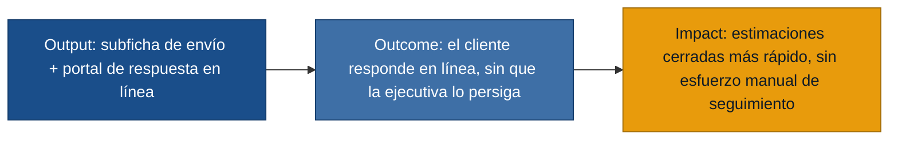

# MVP Canvas — Automatización de estimación

## Cadena de valor

| Bloque | Contenido |
|---|---|
| Propuesta de valor | La ejecutiva de ventas envía la estimación al cliente con sus anexos directamente desde el formulario (sin descargar/redactar nada aparte), y el cliente responde (acepta o rechaza) desde un portal en línea — el sistema actualiza el estado y notifica el resultado automáticamente, sin que la ejecutiva tenga que llamarlo o escribirle para saber si sigue interesado. |
| Segmento de usuarios | Ejecutiva de ventas (persona primaria, respaldada por dos entrevistas de primera mano). Cliente y Gerente de ventas se benefician como stakeholders del mismo flujo. |
| Funcionalidades mínimas | (1) Precarga automática de ejecutiva comercial/departamento/oficina al seleccionar el cliente (US-01). (2) Subficha de comunicación con mensaje y adjuntos xlsx/PDF (US-02). (3) Envío al cliente de un PDF unificado con estrategia de venta, plantilla y bienes (US-03). (4) Portal en línea para que el cliente acepte o rechace (US-04). (5) Actualización automática de estado y notificación a la ejecutiva en ambos casos (US-05, US-06). (6) Notificación del resultado al gerente de ventas (US-07). |
| Resultado esperado (outcome) | Las ejecutivas dejan de perseguir manualmente a los clientes por teléfono o correo para saber si una estimación fue aceptada o rechazada, porque el cliente responde en línea y el sistema notifica el resultado sin intervención manual. |
| Métrica de éxito | % de estimaciones enviadas por el sistema que reciben respuesta del cliente (aceptar/rechazar) a través del portal en línea dentro de 72 horas, sin que la ejecutiva tenga que llamar o escribir manualmente para obtenerla. Prueba ácida: si esta métrica sube, el negocio puede decidir invertir en ampliar el autoservicio del portal (p. ej. recordatorios automáticos); si se mantiene baja, indica que el portal no está reemplazando el seguimiento manual y hay que rediseñarlo o reforzar el aviso al cliente — en cualquier caso cambia una decisión concreta. |
| Riesgos / supuestos | (1) Se asume que el cliente está dispuesto a usar un portal en línea para responder en vez de correo/teléfono — no hay entrevista directa al cliente que lo confirme. (2) Se asume que todo cliente relevante ya tiene una "ejecutiva comercial" relacionada en su registro; si no, la precarga de US-01 no tiene de dónde cargar. (3) El formato de envío (PDF unificado, R-05) ya no está en conflicto entre fuentes, pero sigue siendo un supuesto de diseño no validado con el cliente final, que es quien realmente lo recibe. (4) `ejecutiva-ventas3.md` (fuente de US-07 y de las notificaciones al gerente) tiene una etiqueta de rol ambigua — su `rol_entrevistado` dice "ejecutiva de ventas" pero el contenido describe a una gerente; se interpretó por el contenido, pero conviene confirmar con quien gestiona las entrevistas si la etiqueta es un error (ver nota en `personas.md`). |
| Fuera de alcance (por ahora) | **R-10** (correo de seguimiento al gerente en el momento del envío, antes de la respuesta del cliente): se prioriza primero la notificación de resultado (US-07), que da visibilidad real de cierre; el aviso de "se envió una estimación" puede esperar a una siguiente iteración. **R-11** (vista grid/tabla de bienes cargados dentro de la estimación): es una mejora de visualización interna, no bloquea el flujo de envío/respuesta del cliente que es el núcleo de valor. **R-02/R-03** (defaults de estado/probabilidad, ingreso manual de artículos): no son parte del problema a resolver — la evidencia los describe como comportamiento ya esperado, sin cambios pedidos. |
