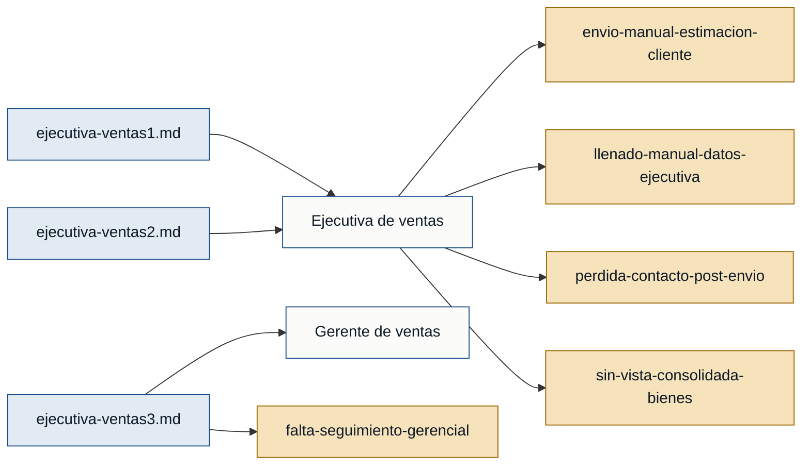

# Personas y stakeholders — Automatización de estimación

> Evidencia disponible: 3 entrevistas — `ejecutiva-ventas1.md` y
> `ejecutiva-ventas2.md` (ambas con rol "ejecutiva de ventas", primera
> persona) y `ejecutiva-ventas3.md` (rol_entrevistado literal "ejecutiva de
> ventas", primera persona — ver nota de calidad de evidencia abajo, el
> contenido sigue describiendo a una gerente).

## Mapa de trazabilidad

## Personas

### E. (ejecutiva de ventas) — ejecutiva de ventas
- **Contexto:** Prepara estimaciones de venta para clientes en el sistema y
  hoy las envía de forma manual: descarga la plantilla del formulario y
  redacta el correo aparte (ejecutiva-ventas1.md, ejecutiva-ventas2.md).
- **Objetivo principal:** Agilizar la preparación y el envío de la
  estimación, y mantener visibilidad sobre el interés del cliente después de
  enviarla, sin tener que perseguirlo por teléfono o correo
  (ejecutiva-ventas1.md).
- **Dolores:**
  - `envio-manual-estimacion-cliente`: El envío de la estimación al cliente es
    manual (descarga de plantilla + correo redactado aparte); no existe una
    subficha de comunicación integrada en el formulario (ejecutiva-ventas1.md;
    corroborado por ejecutiva-ventas2.md).
  - `llenado-manual-datos-ejecutiva`: Los campos de ejecutiva comercial,
    departamento y oficina se llenan manualmente en cada estimación, aunque
    esa información ya está relacionada con el cliente en el sistema
    (ejecutiva-ventas1.md).
  - `perdida-contacto-post-envio`: Tras enviar la estimación, pierde el
    contacto directo con el cliente y debe escribirle o llamarlo para saber
    si sigue interesado, porque no hay un mecanismo en el sistema para que el
    cliente responda y ella se entere automáticamente (ejecutiva-ventas1.md).
  - `sin-vista-consolidada-bienes`: No existe en el sistema una vista tipo
    grid/tabla de los bienes cargados por Excel asociados a una estimación,
    lo que dificulta tener una visión clara de qué bienes están asociados
    (ejecutiva-ventas1.md).
- **Respaldo:** `primera mano` (doble: ejecutiva-ventas1.md y
  ejecutiva-ventas2.md)

## Stakeholders

### Cliente
- **Interés en el sistema:** Recibir la estimación con sus anexos de forma
  clara por correo y poder revisar/aceptar/rechazar la propuesta en línea
  (ejecutiva-ventas1.md, ejecutiva-ventas2.md, ejecutiva-ventas3.md).
- **Fuente:** ejecutiva-ventas1.md, ejecutiva-ventas2.md, ejecutiva-ventas3.md

> Nota: el cliente no fue entrevistado; su interés se infiere de cómo las
> entrevistadas describen lo que necesitan entregarle. No hay evidencia de que
> el cliente opere el sistema de estimaciones directamente (solo el portal de
> aceptación/rechazo descrito por las entrevistadas), por lo que se clasifica
> como stakeholder y no como persona.

### Gerente de ventas
- **Interés en el sistema:** Tener visibilidad de qué ejecutiva está vendiendo
  a qué cliente (correo de seguimiento al enviarse una estimación) y conocer
  el resultado de cada estimación (correo cuando el cliente acepta o rechaza),
  sin operar el formulario de estimación directamente (ejecutiva-ventas3.md).
- **Fuente:** ejecutiva-ventas3.md

> ⚠️ **Nota de calidad de evidencia:** en `ejecutiva-ventas3.md`, el
> `rol_entrevistado` del frontmatter y las etiquetas de diálogo cambiaron de
> "gerente de ventas" a "ejecutiva de ventas" en una ronda anterior de
> evidencia, pero el **contenido no cambió en sustancia**: sigue hablando de
> "mis ejecutivas de ventas", de un correo de seguimiento "para visualizar
> quién está vendiendo a quién", y de recibir notificaciones de
> aceptación/rechazo por separado de "la ejecutiva de venta" — descripciones
> propias de quien supervisa a un equipo, no de una ejecutiva que vende
> directamente. Se mantiene esta entrevista como respaldo del stakeholder
> **Gerente de ventas** (por el contenido, que es lo que sustenta cada dolor y
> requisito), no como una tercera entrevista de primera mano de la persona
> "Ejecutiva de ventas" — aceptar la etiqueta literal sin más habría
> atribuido a la persona equivocada un conjunto de dolores que, por su
> contenido, describen a otra persona. Se recomienda confirmar con quien
> gestiona las entrevistas si el cambio de etiqueta fue intencional o un
> error de captura.

## Advertencia de cobertura

Hay 1 persona primaria (Ejecutiva de ventas), respaldada por **dos**
entrevistas de primera mano consistentes entre sí. El stakeholder Gerente de
ventas tiene una sola fuente, cuya etiqueta de rol es ahora ambigua (ver nota
arriba) — esto no bloquea el MVP porque Gerente de ventas es un stakeholder,
no una persona primaria, pero conviene resolver la ambigüedad de la fuente. No
hay evidencia de otros roles (back office, soporte técnico, servicio al
cliente); si existen, requieren su propia entrevista.
