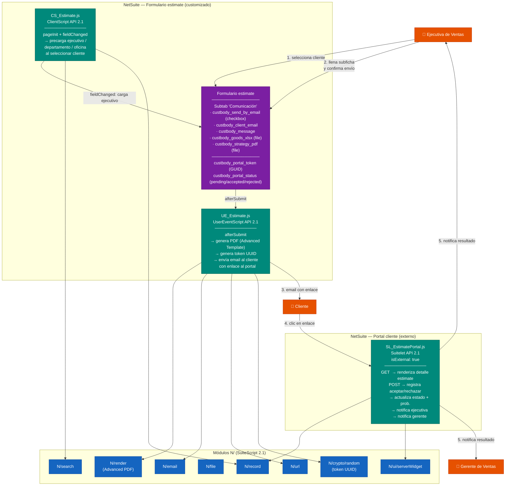

# Arquitectura — Automatización de estimación
> Delivery: `automatizacion-estimacion` · Generado: 2026-06-25
> Plataforma: **Oracle NetSuite · SuiteScript API 2.1** · Record: `estimate`

---

## Principio guía

La arquitectura más simple que entrega el valor del MVP: dos scripts sobre el
formulario de estimación nativo de NetSuite más un Suitelet externo para el
portal del cliente. Sin servicios externos, sin middleware. Todo dentro del
sandbox de SuiteScript 2.1.

---

## Diagrama de componentes

---

## Componentes

### CS_Estimate.js — ClientScript (US-01)
- **Evento:** `fieldChanged` sobre el campo cliente (`entity`).
- **Lógica:** Busca con `N/search` la ejecutiva comercial relacionada al cliente seleccionado → precarga campos ejecutiva, departamento y oficina → los deshabilita para edición manual (`setFieldDisabled`).
- **Evento adicional:** `pageInit` para deshabilitar los campos si el registro ya tiene cliente al abrirse.

### UE_Estimate.js — UserEventScript (US-02, US-03)
- **Evento:** `afterSubmit` (tipo `create` y `edit`).
- **Lógica:**
  1. Lee `custbody_send_by_email`. Si no está marcado, sale sin hacer nada.
  2. Genera un UUID con `N/crypto/random` y lo guarda en `custbody_portal_token`.
  3. Genera el PDF unificado con `N/render` usando el Advanced PDF Template del estimate (ver ADR-0004).
  4. Construye la URL del portal con `N/url.resolveScript` + el token.
  5. Envía el email al cliente con `N/email.send` adjuntando el PDF y el enlace al portal.
  6. Desmarca `custbody_send_by_email` para evitar re-envíos accidentales.

### SL_EstimatePortal.js — Suitelet externo (US-04, US-05, US-06, US-07)
- **Acceso:** `isExternal: true` — no requiere login en NetSuite.
- **GET:** Recibe `?token=<UUID>` → busca el estimate por `custbody_portal_token` → renderiza página con detalle y botones aceptar/rechazar usando `N/ui/serverWidget`.
- **POST:** Recibe la acción del cliente → actualiza `custbody_portal_status`, `status` y `probability` del estimate → envía email de confirmación al cliente + notificación a ejecutiva + notificación al gerente de ventas.

### Advanced PDF Template — TPL_EstimateUnified (US-03)
- Template BFO de NetSuite que consolida en un único PDF: datos de la estimación (líneas de artículos, totales, cliente, ejecutiva) + sección de estrategia de venta si `custbody_strategy_pdf` fue cargado.
- Ver ADR-0004 para la restricción del merge de PDFs.

---

## Campos custom requeridos en el record `estimate`

| Campo interno | Tipo | Descripción |
|---|---|---|
| `custbody_send_by_email` | Checkbox | Activa el envío desde la subficha Comunicación |
| `custbody_client_email` | Email | Correo del cliente destinatario |
| `custbody_message` | Text Area | Mensaje de la ejecutiva al cliente |
| `custbody_goods_xlsx` | File | Excel de bienes a incluir en el PDF |
| `custbody_strategy_pdf` | File | PDF opcional de estrategia de venta |
| `custbody_portal_token` | Text | UUID del enlace del portal (generado por UE) |
| `custbody_portal_status` | List | pending / accepted / rejected |

---

## Preguntas abiertas (lo que se decidió NO diseñar todavía)

1. **Merge nativo de PDFs en SuiteScript 2.1:** NetSuite no expone una API de merge de PDFs. Explorar si un bundle SuiteApp de terceros o `N/pdf` (si disponible en el account) lo permite. Hasta resolverse, el PDF de estrategia de venta se adjunta como archivo separado en el email (ver ADR-0004).
2. **Relación ejecutiva-cliente en el modelo de datos de Carseg:** Se asume que existe una relación accesible vía `N/search` (p. ej. un campo custom en el registro de cliente). Confirmar antes de implementar CS_Estimate.js.
3. **Identidad del gerente de ventas:** Se asume que el gerente está identificable desde el registro de la ejecutiva (p. ej. campo supervisor o un campo custom). Confirmar para implementar la notificación de US-07.
4. **Seguridad del token:** El token UUID de un solo uso es suficiente para MVP, pero no invalida el token post-respuesta. Decidir si se debe invalidar al responder (recomendado) o permitir múltiples visitas al portal.
5. **Límites de tiempo en afterSubmit:** Si la generación del PDF es lenta, `afterSubmit` puede alcanzar el límite de ejecución. Evaluar mover a un `MapReduce` o `Scheduled Script` si se detecta el problema en QA.
