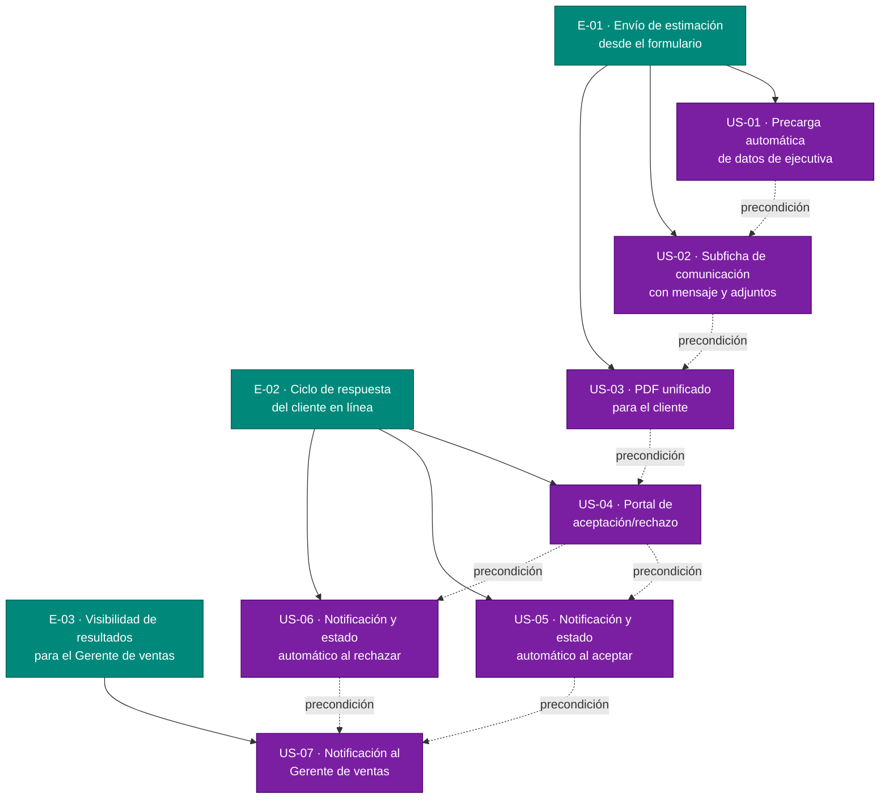

# Épicas del MVP — Automatización de estimación
> Delivery: `automatizacion-estimacion` · Generado: 2026-06-25
> Fuente de verdad: `inbox/mvp-canvas.md`, `inbox/user-stories.md`, `inbox/requisitos.md`, `inbox/personas.md`, `inbox/evidence-map.json`

---

## E-01 · Envío de estimación desde el formulario

**Valor (outcome):** La ejecutiva de ventas deja de salir del sistema para enviar la estimación: pasa de descargar la plantilla y redactar el correo en forma externa a confirmar el envío desde una subficha integrada en el formulario. Elimina el dolor `envio-manual-estimacion-cliente` y `llenado-manual-datos-ejecutiva`.

**Origen:** `mvp-canvas.md` → "Funcionalidades mínimas (1)(2)(3)"; `requisitos.md` → R-01, R-04, R-05; `personas.md` → dolores `envio-manual-estimacion-cliente`, `llenado-manual-datos-ejecutiva`

**Prioridad:** 1 — Es la precondición de todo el flujo; sin el envío integrado no hay portal de respuesta ni cierre de ciclo. Concentra los dos dolores más frecuentes y con doble respaldo de primera mano.

**Historias:** US-01, US-02, US-03

---

## E-02 · Ciclo de respuesta del cliente en línea

**Valor (outcome):** El cliente acepta o rechaza la estimación desde un portal sin necesidad de llamar a la ejecutiva. El sistema registra la respuesta, actualiza el estado automáticamente y notifica a la ejecutiva. Elimina el dolor `perdida-contacto-post-envio` — el core del MVP.

**Origen:** `mvp-canvas.md` → "Propuesta de valor", "Resultado esperado", "Funcionalidades mínimas (4)(5)"; `requisitos.md` → R-06, R-07, R-08; `personas.md` → dolor `perdida-contacto-post-envio`

**Prioridad:** 2 — Cierra el ciclo de valor: sin la respuesta en línea y la actualización automática de estado, la ejecutiva sigue persiguiendo al cliente por teléfono, que es el dolor central del MVP.

**Historias:** US-04, US-05, US-06

---

## E-03 · Visibilidad de resultados para el Gerente de ventas

**Valor (outcome):** El Gerente de ventas recibe notificación automática del resultado (aceptación o rechazo) de cada estimación, sin tener que consultar a la ejecutiva involucrada. Atiende el dolor `falta-seguimiento-gerencial`.

**Origen:** `mvp-canvas.md` → "Funcionalidades mínimas (6)"; `requisitos.md` → R-09; `personas.md` → dolor `falta-seguimiento-gerencial`; `evidence-map.json` → pain `falta-seguimiento-gerencial`

**Prioridad:** 3 — Aporta visibilidad gerencial pero no desbloquea ni modifica el flujo primario ejecutiva-cliente. Va después porque depende de que E-02 esté operativo y porque su única fuente de evidencia tiene ambigüedad de rol (ver nota en `personas.md`).

**Historias:** US-07

---

## Diagrama de backlog

